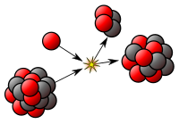

<table class="vertical-navbox nowraplinks">
<tbody>
<tr>
<th><a title="Nuclear physics" href="https://en.wikipedia.org/wiki/Nuclear_physics">Nuclear physics</a></th>
</tr>
<tr>
<td></td>
</tr>
<tr>
<td><a title="Atomic nucleus" href="https://en.wikipedia.org/wiki/Atomic_nucleus">Nucleus</a>&nbsp;<strong>&middot;</strong>&nbsp;<a title="Nucleon" href="https://en.wikipedia.org/wiki/Nucleon">Nucleons</a>&nbsp;(<a title="Proton" href="https://en.wikipedia.org/wiki/Proton">p</a>,&nbsp;<a title="Neutron" href="https://en.wikipedia.org/wiki/Neutron">n</a>)&nbsp;<strong>&middot;</strong>&nbsp;<a title="Nuclear matter" href="https://en.wikipedia.org/wiki/Nuclear_matter">Nuclear matter</a>&nbsp;<strong>&middot;</strong>&nbsp;<a title="Nuclear force" href="https://en.wikipedia.org/wiki/Nuclear_force">Nuclear force</a>&nbsp;<strong>&middot;</strong>&nbsp;<a title="Nuclear structure" href="https://en.wikipedia.org/wiki/Nuclear_structure">Nuclear structure</a>&nbsp;<strong>&middot;</strong>&nbsp;<a title="Nuclear reaction" href="https://en.wikipedia.org/wiki/Nuclear_reaction">Nuclear reaction</a></td>
</tr>
<tr>
<td>

<a class="mw-redirect" title="Nuclear model" href="https://en.wikipedia.org/wiki/Nuclear_model">Models of the nucleus</a>

<a title="Semi-empirical mass formula" href="https://en.wikipedia.org/wiki/Semi-empirical_mass_formula">Liquid drop</a>&nbsp;<strong>&middot;</strong>&nbsp;<a title="Nuclear shell model" href="https://en.wikipedia.org/wiki/Nuclear_shell_model">Nuclear shell model</a>&nbsp;<strong>&middot;</strong>&nbsp;<a title="Interacting boson model" href="https://en.wikipedia.org/wiki/Interacting_boson_model">Interacting boson model</a>&nbsp;<strong>&middot;</strong>&nbsp;<a title="Ab initio methods (nuclear physics)" href="https://en.wikipedia.org/wiki/Ab_initio_methods_(nuclear_physics)">Ab initio</a>

</td>
</tr>
<tr>
<td>

<a title="Nuclide" href="https://en.wikipedia.org/wiki/Nuclide">Nuclides</a>' classification

<a title="Isotope" href="https://en.wikipedia.org/wiki/Isotope">Isotopes</a>&nbsp;&ndash; equal&nbsp;<a title="Atomic number" href="https://en.wikipedia.org/wiki/Atomic_number"><em>Z</em></a> <a title="Isobar (nuclide)" href="https://en.wikipedia.org/wiki/Isobar_(nuclide)">Isobars</a>&nbsp;&ndash; equal&nbsp;<a title="Mass number" href="https://en.wikipedia.org/wiki/Mass_number"><em>A</em></a> <a title="Isotone" href="https://en.wikipedia.org/wiki/Isotone">Isotones</a>&nbsp;&ndash; equal&nbsp;<a title="Neutron number" href="https://en.wikipedia.org/wiki/Neutron_number"><em>N</em></a> <a class="mw-redirect" title="Isodiapher" href="https://en.wikipedia.org/wiki/Isodiapher">Isodiaphers</a>&nbsp;&ndash; equal&nbsp;<a class="mw-redirect" title="Neutron excess" href="https://en.wikipedia.org/wiki/Neutron_excess"><em>N</em>&nbsp;&minus;&nbsp;<em>Z</em></a> &nbsp;&nbsp;&nbsp;&nbsp;&nbsp;<a title="Nuclear isomer" href="https://en.wikipedia.org/wiki/Nuclear_isomer">Isomers</a>&nbsp;&ndash; equal all the above <a title="Mirror nuclei" href="https://en.wikipedia.org/wiki/Mirror_nuclei">Mirror nuclei</a>&nbsp;&ndash;&nbsp;<em>Z</em>&nbsp;&harr;&nbsp;<em>N</em> <a class="mw-redirect" title="Stable isotope" href="https://en.wikipedia.org/wiki/Stable_isotope">Stable</a>&nbsp;<strong>&middot;</strong>&nbsp;<a title="Magic number (physics)" href="https://en.wikipedia.org/wiki/Magic_number_(physics)">Magic</a>&nbsp;<strong>&middot;</strong>&nbsp;<a title="Even and odd atomic nuclei" href="https://en.wikipedia.org/wiki/Even_and_odd_atomic_nuclei">Even/odd</a>&nbsp;<strong>&middot;</strong>&nbsp;<a title="Halo nucleus" href="https://en.wikipedia.org/wiki/Halo_nucleus">Halo</a>&nbsp;(<a title="Borromean nucleus" href="https://en.wikipedia.org/wiki/Borromean_nucleus">Borromean</a>)

</td>
</tr>
<tr>
<td>

Nuclear stability

<a class="mw-selflink selflink">Binding energy</a>&nbsp;<strong>&middot;</strong>&nbsp;<a class="mw-redirect" title="Proton&ndash;neutron ratio" href="https://en.wikipedia.org/wiki/Proton%E2%80%93neutron_ratio">p&ndash;n ratio</a>&nbsp;<strong>&middot;</strong>&nbsp;<a title="Nuclear drip line" href="https://en.wikipedia.org/wiki/Nuclear_drip_line">Drip line</a>&nbsp;<strong>&middot;</strong>&nbsp;<a title="Island of stability" href="https://en.wikipedia.org/wiki/Island_of_stability">Island of stability</a>&nbsp;<strong>&middot;</strong>&nbsp;<a title="Valley of stability" href="https://en.wikipedia.org/wiki/Valley_of_stability">Valley of stability</a>

</td>
</tr>
<tr>
<td>

<a title="Radioactive decay" href="https://en.wikipedia.org/wiki/Radioactive_decay">Radioactive decay</a>

<a title="Alpha decay" href="https://en.wikipedia.org/wiki/Alpha_decay">Alpha&nbsp;&alpha;</a>&nbsp;<strong>&middot;</strong>&nbsp;<a title="Beta decay" href="https://en.wikipedia.org/wiki/Beta_decay">Beta&nbsp;&beta;</a>&nbsp;(<a title="Double beta decay" href="https://en.wikipedia.org/wiki/Double_beta_decay">2&beta;</a>,&nbsp;<a title="Positron emission" href="https://en.wikipedia.org/wiki/Positron_emission">&beta;+</a>)&nbsp;<strong>&middot;</strong>&nbsp;<a title="Electron capture" href="https://en.wikipedia.org/wiki/Electron_capture">K/L&nbsp;capture</a>&nbsp;<strong>&middot;</strong>&nbsp;<a class="mw-redirect" title="Isomeric transition" href="https://en.wikipedia.org/wiki/Isomeric_transition">Isomeric</a>&nbsp;(<a title="Gamma ray" href="https://en.wikipedia.org/wiki/Gamma_ray">Gamma &gamma;</a>&nbsp;<strong>&middot;</strong>&nbsp;<a title="Internal conversion" href="https://en.wikipedia.org/wiki/Internal_conversion">Internal conversion</a>)&nbsp;<strong>&middot;</strong>&nbsp;<a title="Spontaneous fission" href="https://en.wikipedia.org/wiki/Spontaneous_fission">Spontaneous fission</a>&nbsp;<strong>&middot;</strong>&nbsp;<a title="Cluster decay" href="https://en.wikipedia.org/wiki/Cluster_decay">Cluster decay</a>&nbsp;<strong>&middot;</strong>&nbsp;<a title="Neutron emission" href="https://en.wikipedia.org/wiki/Neutron_emission">Neutron emission</a>&nbsp;<strong>&middot;</strong>&nbsp;<a title="Proton emission" href="https://en.wikipedia.org/wiki/Proton_emission">Proton emission</a>

<a title="Decay energy" href="https://en.wikipedia.org/wiki/Decay_energy">Decay energy</a>&nbsp;<strong>&middot;</strong>&nbsp;<a title="Decay chain" href="https://en.wikipedia.org/wiki/Decay_chain">Decay chain</a>&nbsp;<strong>&middot;</strong>&nbsp;<a title="Decay product" href="https://en.wikipedia.org/wiki/Decay_product">Decay product</a>&nbsp;<strong>&middot;</strong>&nbsp;<a title="Radiogenic nuclide" href="https://en.wikipedia.org/wiki/Radiogenic_nuclide">Radiogenic nuclide</a>

</td>
</tr>
<tr>
<td>

<a title="Nuclear fission" href="https://en.wikipedia.org/wiki/Nuclear_fission">Nuclear fission</a>

<a title="Spontaneous fission" href="https://en.wikipedia.org/wiki/Spontaneous_fission">Spontaneous</a>&nbsp;<strong>&middot;</strong>&nbsp;<a title="Nuclear fission product" href="https://en.wikipedia.org/wiki/Nuclear_fission_product">Products</a>&nbsp;(<a title="Nucleon pair breaking in fission" href="https://en.wikipedia.org/wiki/Nucleon_pair_breaking_in_fission">pair breaking</a>)&nbsp;<strong>&middot;</strong>&nbsp;<a title="Photofission" href="https://en.wikipedia.org/wiki/Photofission">Photofission</a>

</td>
</tr>
<tr>
<td>

Capturing processes

<a title="Electron capture" href="https://en.wikipedia.org/wiki/Electron_capture">electron</a>&nbsp;(<a title="Double electron capture" href="https://en.wikipedia.org/wiki/Double_electron_capture">2&times;</a>)&nbsp;<strong>&middot;</strong>&nbsp;<a title="Neutron capture" href="https://en.wikipedia.org/wiki/Neutron_capture">neutron</a>&nbsp;(<a title="S-process" href="https://en.wikipedia.org/wiki/S-process">s</a>&nbsp;<strong>&middot;</strong>&nbsp;<a title="R-process" href="https://en.wikipedia.org/wiki/R-process">r</a>)&nbsp;<strong>&middot;</strong>&nbsp;<a title="Proton capture" href="https://en.wikipedia.org/wiki/Proton_capture">proton</a>&nbsp;(<a title="P-process" href="https://en.wikipedia.org/wiki/P-process">p</a>&nbsp;<strong>&middot;</strong>&nbsp;<a title="Rp-process" href="https://en.wikipedia.org/wiki/Rp-process">rp</a>)

</td>
</tr>
<tr>
<td>

High-energy processes

<a title="Spallation" href="https://en.wikipedia.org/wiki/Spallation">Spallation</a>&nbsp;(<a title="Cosmic ray spallation" href="https://en.wikipedia.org/wiki/Cosmic_ray_spallation">by cosmic ray</a>)&nbsp;<strong>&middot;</strong>&nbsp;<a title="Photodisintegration" href="https://en.wikipedia.org/wiki/Photodisintegration">Photodisintegration</a>

</td>
</tr>
<tr>
<td>

<a title="Nucleosynthesis" href="https://en.wikipedia.org/wiki/Nucleosynthesis">Nucleosynthesis</a>&nbsp;and <a title="Nuclear astrophysics" href="https://en.wikipedia.org/wiki/Nuclear_astrophysics">nuclear astrophysics</a>

<a title="Nuclear fusion" href="https://en.wikipedia.org/wiki/Nuclear_fusion">Nuclear fusion</a> <small>Processes:</small>&nbsp;<a title="Stellar nucleosynthesis" href="https://en.wikipedia.org/wiki/Stellar_nucleosynthesis">Stellar</a>&nbsp;<strong>&middot;</strong>&nbsp;<a title="Big Bang nucleosynthesis" href="https://en.wikipedia.org/wiki/Big_Bang_nucleosynthesis">Big Bang</a>&nbsp;<strong>&middot;</strong>&nbsp;<a title="Supernova nucleosynthesis" href="https://en.wikipedia.org/wiki/Supernova_nucleosynthesis">Supernova</a> Nuclides:&nbsp;<a title="Primordial nuclide" href="https://en.wikipedia.org/wiki/Primordial_nuclide">Primordial</a>&nbsp;<strong>&middot;</strong>&nbsp;<a title="Cosmogenic nuclide" href="https://en.wikipedia.org/wiki/Cosmogenic_nuclide">Cosmogenic</a>&nbsp;<strong>&middot;</strong>&nbsp;<a title="Synthetic element" href="https://en.wikipedia.org/wiki/Synthetic_element">Artificial</a>

</td>
</tr>
<tr>
<td>

<a title="High-energy nuclear physics" href="https://en.wikipedia.org/wiki/High-energy_nuclear_physics">High-energy nuclear physics</a>

<a title="Quark&ndash;gluon plasma" href="https://en.wikipedia.org/wiki/Quark%E2%80%93gluon_plasma">Quark&ndash;gluon plasma</a>&nbsp;<strong>&middot;</strong>&nbsp;<a title="Relativistic Heavy Ion Collider" href="https://en.wikipedia.org/wiki/Relativistic_Heavy_Ion_Collider">RHIC</a>&nbsp;<strong>&middot;</strong>&nbsp;<a title="Large Hadron Collider" href="https://en.wikipedia.org/wiki/Large_Hadron_Collider">LHC</a>

</td>
</tr>
<tr>
<td>

<a title="Category:Nuclear physicists" href="https://en.wikipedia.org/wiki/Category:Nuclear_physicists">Scientists</a>

<a title="Luis Walter Alvarez" href="https://en.wikipedia.org/wiki/Luis_Walter_Alvarez">Alvarez</a>&nbsp;<strong>&middot;</strong>&nbsp;<a title="Henri Becquerel" href="https://en.wikipedia.org/wiki/Henri_Becquerel">Becquerel</a>&nbsp;<strong>&middot;</strong>&nbsp;<a title="Hans Bethe" href="https://en.wikipedia.org/wiki/Hans_Bethe">Bethe</a>&nbsp;<strong>&middot;</strong>&nbsp;<a title="Aage Bohr" href="https://en.wikipedia.org/wiki/Aage_Bohr">A.&nbsp;Bohr</a>&nbsp;<strong>&middot;</strong>&nbsp;<a title="Niels Bohr" href="https://en.wikipedia.org/wiki/Niels_Bohr">N.&nbsp;Bohr</a>&nbsp;<strong>&middot;</strong>&nbsp;<a title="James Chadwick" href="https://en.wikipedia.org/wiki/James_Chadwick">Chadwick</a>&nbsp;<strong>&middot;</strong>&nbsp;<a title="John Cockcroft" href="https://en.wikipedia.org/wiki/John_Cockcroft">Cockcroft</a>&nbsp;<strong>&middot;</strong>&nbsp;<a title="Ir&egrave;ne Joliot-Curie" href="https://en.wikipedia.org/wiki/Ir%C3%A8ne_Joliot-Curie">Ir.&nbsp;Curie</a>&nbsp;<strong>&middot;</strong>&nbsp;<a title="Fr&eacute;d&eacute;ric Joliot-Curie" href="https://en.wikipedia.org/wiki/Fr%C3%A9d%C3%A9ric_Joliot-Curie">Fr.&nbsp;Curie</a>&nbsp;<strong>&middot;</strong>&nbsp;<a title="Pierre Curie" href="https://en.wikipedia.org/wiki/Pierre_Curie">Pi.&nbsp;Curie</a>&nbsp;<strong>&middot;</strong>&nbsp;<a title="Marie Curie" href="https://en.wikipedia.org/wiki/Marie_Curie">Skłodowska-Curie</a>&nbsp;<strong>&middot;</strong>&nbsp;<a title="Clinton Davisson" href="https://en.wikipedia.org/wiki/Clinton_Davisson">Davisson</a>&nbsp;<strong>&middot;</strong>&nbsp;<a title="Enrico Fermi" href="https://en.wikipedia.org/wiki/Enrico_Fermi">Fermi</a>&nbsp;<strong>&middot;</strong>&nbsp;<a title="Otto Hahn" href="https://en.wikipedia.org/wiki/Otto_Hahn">Hahn</a>&nbsp;<strong>&middot;</strong>&nbsp;<a title="J. Hans D. Jensen" href="https://en.wikipedia.org/wiki/J._Hans_D._Jensen">Jensen</a>&nbsp;<strong>&middot;</strong>&nbsp;<a title="Ernest Lawrence" href="https://en.wikipedia.org/wiki/Ernest_Lawrence">Lawrence</a>&nbsp;<strong>&middot;</strong>&nbsp;<a class="mw-redirect" title="Maria Goeppert-Mayer" href="https://en.wikipedia.org/wiki/Maria_Goeppert-Mayer">Mayer</a>&nbsp;<strong>&middot;</strong>&nbsp;<a title="Lise Meitner" href="https://en.wikipedia.org/wiki/Lise_Meitner">Meitner</a>&nbsp;<strong>&middot;</strong>&nbsp;<a title="Mark Oliphant" href="https://en.wikipedia.org/wiki/Mark_Oliphant">Oliphant</a>&nbsp;<strong>&middot;</strong>&nbsp;<a title="J. Robert Oppenheimer" href="https://en.wikipedia.org/wiki/J._Robert_Oppenheimer">Oppenheimer</a>&nbsp;<strong>&middot;</strong>&nbsp;<a title="Alexandru Proca" href="https://en.wikipedia.org/wiki/Alexandru_Proca">Proca</a>&nbsp;<strong>&middot;</strong>&nbsp;<a title="Edward Mills Purcell" href="https://en.wikipedia.org/wiki/Edward_Mills_Purcell">Purcell</a>&nbsp;

<a title="Isidor Isaac Rabi" href="https://en.wikipedia.org/wiki/Isidor_Isaac_Rabi">Rabi</a>&nbsp;<strong>&middot;</strong>&nbsp;<a title="Ernest Rutherford" href="https://en.wikipedia.org/wiki/Ernest_Rutherford">Rutherford</a>&nbsp;<strong>&middot;</strong>&nbsp;<a title="Frederick Soddy" href="https://en.wikipedia.org/wiki/Frederick_Soddy">Soddy</a>&nbsp;<strong>&middot;</strong>&nbsp;<a title="Fritz Strassmann" href="https://en.wikipedia.org/wiki/Fritz_Strassmann">Strassmann</a>&nbsp;<strong>&middot;</strong>&nbsp;<a title="Władysław Świątecki (physicist)" href="https://en.wikipedia.org/wiki/W%C5%82adys%C5%82aw_%C5%9Awi%C4%85tecki_(physicist)">Świątecki</a>&nbsp;<strong>&middot;</strong>&nbsp;<a class="mw-redirect" title="Le&oacute; Szil&aacute;rd" href="https://en.wikipedia.org/wiki/Le%C3%B3_Szil%C3%A1rd">Szil&aacute;rd</a>&nbsp;<strong>&middot;</strong>&nbsp;<a title="Edward Teller" href="https://en.wikipedia.org/wiki/Edward_Teller">Teller</a>&nbsp;<strong>&middot;</strong>&nbsp;<a title="J. J. Thomson" href="https://en.wikipedia.org/wiki/J._J._Thomson">Thomson</a>&nbsp;<strong>&middot;</strong>&nbsp;<a title="Ernest Walton" href="https://en.wikipedia.org/wiki/Ernest_Walton">Walton</a>&nbsp;<strong>&middot;</strong>&nbsp;<a title="Eugene Wigner" href="https://en.wikipedia.org/wiki/Eugene_Wigner">Wigner</a>

</td>
</tr>
</tbody>
</table>
 

<h2> Books </h2>

<ul>

                             

 <li><a target="_blank" href="https://github.com/manjunath5496/Nuclear-Physics-Books/blob/master/nmg(1).pdf" style="text-decoration:none;">Introduction
to Atomic and Nuclear Physics</a></li>

 <li><a target="_blank" href="https://github.com/manjunath5496/Nuclear-Physics-Books/blob/master/nmg(2).pdf" style="text-decoration:none;">Concepts of Nuclear Physics</a></li>

<li><a target="_blank" href="https://github.com/manjunath5496/Nuclear-Physics-Books/blob/master/nmg(3).pdf" style="text-decoration:none;">Nuclear physics: a course given by Enrico Fermi at the University of Chicago</a></li>
 <li><a target="_blank" href="https://github.com/manjunath5496/Nuclear-Physics-Books/blob/master/nmg(4).pdf" style="text-decoration:none;">Theoretical Nuclear Physics In Italy</a></li>                              
<li><a target="_blank" href="https://github.com/manjunath5496/Nuclear-Physics-Books/blob/master/nmg(5).pdf" style="text-decoration:none;"> Nuclear Physics at
Border Lines</a></li>
<li><a target="_blank" href="https://github.com/manjunath5496/Nuclear-Physics-Books/blob/master/nmg(6).pdf" style="text-decoration:none;">Nuclear Physics: Principles and Applications </a></li>
 <li><a target="_blank" href="https://github.com/manjunath5496/Nuclear-Physics-Books/blob/master/nmg(7).pdf" style="text-decoration:none;">Elements of nuclear physics</a></li>

 <li><a target="_blank" href="https://github.com/manjunath5496/Nuclear-Physics-Books/blob/master/nmg(8).pdf" style="text-decoration:none;">Intermediate-Energy
Nuclear Physics</a></li>
   <li><a target="_blank" href="https://github.com/manjunath5496/Nuclear-Physics-Books/blob/master/nmg(9).pdf" style="text-decoration:none;">Nuclear Physics and
Interaction of Particles with Matter</a></li>
  
   
 <li><a target="_blank" href="https://github.com/manjunath5496/Nuclear-Physics-Books/blob/master/nmg(10).pdf" style="text-decoration:none;">International Conference on
Quark Nuclear Physics</a></li>                              
<li><a target="_blank" href="https://github.com/manjunath5496/Nuclear-Physics-Books/blob/master/nmg(11).pdf" style="text-decoration:none;"> Short-Distance Phenomena
in Nuclear Physics</a></li>
<li><a target="_blank" href="https://github.com/manjunath5496/Nuclear-Physics-Books/blob/master/nmg(12).pdf" style="text-decoration:none;">Nuclear Physics:
Present and Future</a></li>
<li><a target="_blank" href="https://github.com/manjunath5496/Nuclear-Physics-Books/blob/master/nmg(13).pdf" style="text-decoration:none;">From collective states to quarks in nuclei</a></li>

<li><a target="_blank" href="https://github.com/manjunath5496/Nuclear-Physics-Books/blob/master/nmg(14).pdf" style="text-decoration:none;">Nuclear physics: the core of matter, the fuel of stars</a></li>
                              
<li><a target="_blank" href="https://github.com/manjunath5496/Nuclear-Physics-Books/blob/master/nmg(15).pdf" style="text-decoration:none;">Basic Concepts in
Nuclear Physics: Theory, Experiments and Applications</a></li>

<li><a target="_blank" href="https://github.com/manjunath5496/Nuclear-Physics-Books/blob/master/nmg(16).pdf" style="text-decoration:none;">Advances in Nuclear Physics: Volume 1</a></li>

  <li><a target="_blank" href="https://github.com/manjunath5496/Nuclear-Physics-Books/blob/master/nmg(17).pdf" style="text-decoration:none;">Nuclear Physics
Explained</a></li>   
  
<li><a target="_blank" href="https://github.com/manjunath5496/Nuclear-Physics-Books/blob/master/nmg(18).pdf" style="text-decoration:none;">The Quantum World of Nuclear Physics</a></li> 

  
<li><a target="_blank" href="https://github.com/manjunath5496/Nuclear-Physics-Books/blob/master/nmg(19).pdf" style="text-decoration:none;">Advances in Nuclear Physics: Volume 7 </a></li> 

<li><a target="_blank" href="https://github.com/manjunath5496/Nuclear-Physics-Books/blob/master/nmg(20).pdf" style="text-decoration:none;">Mathematical and Computational Methods in Nuclear Physics: Proceedings of the Sixth Granada Workshop Held in Granada, Spain, October 3–8, 1983</a></li>

<li><a target="_blank" href="https://github.com/manjunath5496/Nuclear-Physics-Books/blob/master/nmg(21).pdf" style="text-decoration:none;">Introductory Nuclear Physics</a></li>
<li><a target="_blank" href="https://github.com/manjunath5496/Nuclear-Physics-Books/blob/master/nmg(22).pdf" style="text-decoration:none;">Nuclear Medicine Physics: The Basics</a></li> 
 <li><a target="_blank" href="https://github.com/manjunath5496/Nuclear-Physics-Books/blob/master/nmg(23).pdf" style="text-decoration:none;">X-rays in atomic and nuclear physics</a></li> 
 

   <li><a target="_blank" href="https://github.com/manjunath5496/Nuclear-Physics-Books/blob/master/nmg(24).pdf" style="text-decoration:none;">Physics Through the 1990s: nuclear physics  </a></li>

<li><a target="_blank" href="https://github.com/manjunath5496/Nuclear-Physics-Books/blob/master/nmg(25).pdf" style="text-decoration:none;">Introduction to
Supersymmetry in Particle and Nuclear Physics</a></li> 

<li><a target="_blank" href="https://github.com/manjunath5496/Nuclear-Physics-Books/blob/master/nmg(26).pdf" style="text-decoration:none;">Nuclear Physics of Stars</a></li>

<li><a target="_blank" href="https://github.com/manjunath5496/Nuclear-Physics-Books/blob/master/nmg(27).pdf" style="text-decoration:none;">Computational Nuclear Physics 2</a></li>
<li><a target="_blank" href="https://github.com/manjunath5496/Nuclear-Physics-Books/blob/master/nmg(28).pdf" style="text-decoration:none;">QCD as a Theory of Hadrons: From Partons to Confinement</a></li> 
 <li><a target="_blank" href="https://github.com/manjunath5496/Nuclear-Physics-Books/blob/master/nmg(29).pdf" style="text-decoration:none;">An Advanced Course in Computational
Nuclear Physics: Bridging the Scales from Quarks to Neutron Stars</a></li> 
 

   <li><a target="_blank" href="https://github.com/manjunath5496/Nuclear-Physics-Books/blob/master/nmg(30).pdf" style="text-decoration:none;">Selected
Exercises in Particle and Nuclear Physics</a></li>

<li><a target="_blank" href="https://github.com/manjunath5496/Nuclear-Physics-Books/blob/master/nmg(31).pdf" style="text-decoration:none;">Electromagnetic Interactions and Hadronic Structure</a></li> 

<li><a target="_blank" href="https://github.com/manjunath5496/Nuclear-Physics-Books/blob/master/nmg(32).pdf" style="text-decoration:none;">Lattice QCD for
Nuclear Physics</a></li>

<li><a target="_blank" href="https://github.com/manjunath5496/Nuclear-Physics-Books/blob/master/nmg(33).pdf" style="text-decoration:none;">An Advanced Course
in Modern Nuclear Physics</a></li>
<li><a target="_blank" href="https://github.com/manjunath5496/Nuclear-Physics-Books/blob/master/nmg(34).pdf" style="text-decoration:none;">Interacting Bosons
in Nuclear Physics</a></li> 
 <li><a target="_blank" href="https://github.com/manjunath5496/Nuclear-Physics-Books/blob/master/nmg(35).pdf" style="text-decoration:none;">The Physics of Warm Nuclei: With Analogies to Mesoscopic Systems</a></li> 
 

   <li><a target="_blank" href="https://github.com/manjunath5496/Nuclear-Physics-Books/blob/master/nmg(36).pdf" style="text-decoration:none;">Nuclear Physics
with Polarized Particles</a></li>

<li><a target="_blank" href="https://github.com/manjunath5496/Nuclear-Physics-Books/blob/master/nmg(37).pdf" style="text-decoration:none;">Fundamentals
of Nuclear Physics</a></li>
<li><a target="_blank" href="https://github.com/manjunath5496/Nuclear-Physics-Books/blob/master/nmg(38).pdf" style="text-decoration:none;">Fundamentals
In Nuclear Physics: From Nuclear Structure to Cosmology</a></li> 
 <li><a target="_blank" href="https://github.com/manjunath5496/Nuclear-Physics-Books/blob/master/nmg(39).pdf" style="text-decoration:none;">Statistical Models for Nuclear Decay: From Evaporation to Vaporization</a></li> 
 

   <li><a target="_blank" href="https://github.com/manjunath5496/Nuclear-Physics-Books/blob/master/nmg(40).pdf" style="text-decoration:none;">Problems and Solutions on Atomic, Nuclear and Particle Physics</a></li>

 <li><a target="_blank" href="https://github.com/manjunath5496/Nuclear-Physics-Books/blob/master/nmg(41).pdf" style="text-decoration:none;">Pomeron Physics and QCD</a></li>

   <li><a target="_blank" href="https://github.com/manjunath5496/Nuclear-Physics-Books/blob/master/nmg(42).pdf" style="text-decoration:none;">Fundamentals of Nuclear Reactor Physics</a></li>

<li><a target="_blank" href="https://github.com/manjunath5496/Nuclear-Physics-Books/blob/master/nmg(43).pdf" style="text-decoration:none;">Nuclear Power Plants:
Innovative Technologies for Instrumentation and Control Systems</a></li>
<li><a target="_blank" href="https://github.com/manjunath5496/Nuclear-Physics-Books/blob/master/nmg(44).pdf" style="text-decoration:none;">The Phases of Quantum Chromodynamics</a></li> 
 <li><a target="_blank" href="https://github.com/manjunath5496/Nuclear-Physics-Books/blob/master/nmg(45).pdf" style="text-decoration:none;">Stochastic Effects: Application in Nuclear Physics</a></li> 
 

   <li><a target="_blank" href="https://github.com/manjunath5496/Nuclear-Physics-Books/blob/master/nmg(46).pdf" style="text-decoration:none;">Heavy Quark Physics</a></li>

 <li><a target="_blank" href="https://github.com/manjunath5496/Nuclear-Physics-Books/blob/master/nmg(47).pdf" style="text-decoration:none;">Changing Facets of Nuclear Structure</a></li>

 <li><a target="_blank" href="https://github.com/manjunath5496/Nuclear-Physics-Books/blob/master/nmg(48).pdf" style="text-decoration:none;">Experimental Nuclear Physics - I</a></li>

<li><a target="_blank" href="https://github.com/manjunath5496/Nuclear-Physics-Books/blob/master/nmg(49).pdf" style="text-decoration:none;"> Methods Of Experimental Physics: Nuclear Physics, Volume 5</a></li> 

<li><a target="_blank" href="https://github.com/manjunath5496/Nuclear-Physics-Books/blob/master/nmg(50).pdf" style="text-decoration:none;">Relativistic Aspects
of Nuclear Physics</a></li>

<li><a target="_blank" href="https://github.com/manjunath5496/Nuclear-Physics-Books/blob/master/nmg(51).pdf" style="text-decoration:none;">Kaplan Nuclear Physics</a></li>

 
 </ul>
